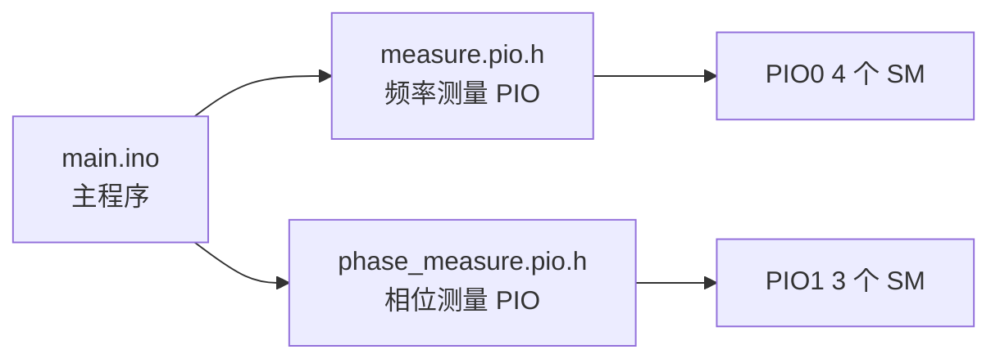
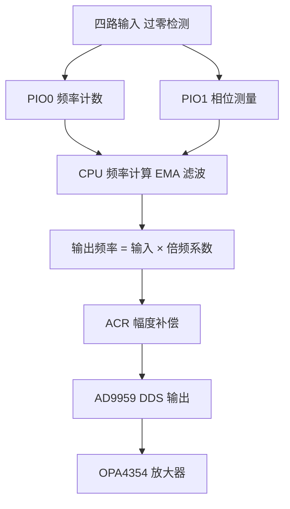
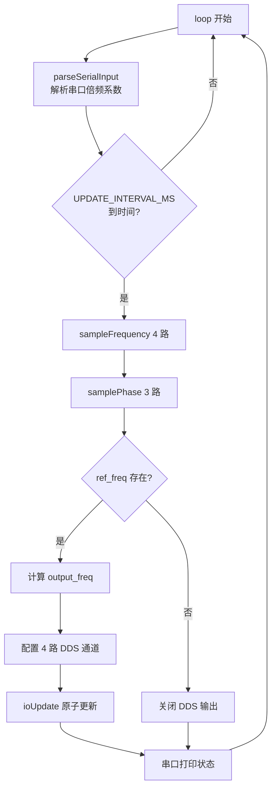
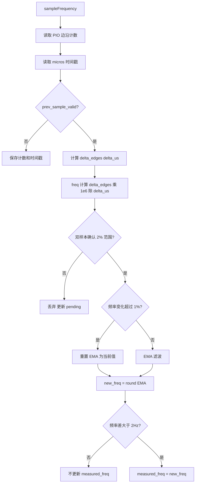

# 四路正交信号频率倍频系统 - 二次开发说明

本文档面向客户二次开发与维护，详细描述代码设计、模块结构、可调参数及修改指引，便于快速展开二次开发和调试。

---

## 1. 项目概述

### 1.1 功能说明

本系统实现四路正交信号（SIN+, COS+, SIN-, COS-）的**频率倍频**：采集输入频率，经 AD9959 DDS 输出 2~20 倍频后的正交信号，并保证输出幅度稳定在 1Vpp。

### 1.2 硬件平台

| 组件 | 型号 | 说明 |
|------|------|------|
| 主控 | RP2040 | 双核 Cortex-M0+，200MHz |
| DDS | AD9959 | 4 通道，500MSPS |
| 过零检测 | MCP6564 | 四通道比较器 |
| 放大器 | OPA4354 | 四通道运放 |

### 1.3 代码结构



| 文件 | 功能 | 说明 |
|------|------|------|
| main.ino | 主程序 | 初始化、主循环、DDS 控制、串口 |
| measure.pio.h | 频率测量 | PIO 边沿计数，4 通道 |
| phase_measure.pio.h | 相位测量 | PIO 相位差测量，3 通道 |

---

## 2. 系统架构与数据流

### 2.1 整体数据流



### 2.2 主循环流程



### 2.3 频率测量流程



---

## 3. 引脚与通道映射

### 3.1 RP2040 引脚分配

| 功能 | GPIO | 说明 |
|------|------|------|
| 频率测量输入 | 0, 1, 2, 3 | 过零检测输出，对应 COS-, SIN+, COS+, SIN- |
| SPI RX | 16 | 接 DDS MISO（如需回读） |
| DDS RESET | 17 | AD9959 复位 |
| DDS SCK | 18 | SPI 时钟 |
| DDS MOSI | 19 | SPI 数据 |
| DDS CS | 20 | 片选 |
| DDS UPDATE | 21 | IO_UPDATE 触发 |

### 3.2 信号与 GPIO 对应

| GPIO | 信号名 | PIO0 SM | PIO1 相位测量 |
|------|--------|---------|---------------|
| 0 | COS- | SM0 | 参考→目标 |
| 1 | SIN+ 参考 | SM1 | 参考 |
| 2 | COS+ | SM2 | 参考→目标 |
| 3 | SIN- | SM3 | 参考→目标 |

### 3.3 GPIO 与 AD9959 通道

| GPIO | 信号 | AD9959 通道 | DDS 输出 |
|------|------|-------------|----------|
| 0 | COS- | IOUT3 | OUT3 |
| 1 | SIN+ | IOUT0 | OUT0 |
| 2 | COS+ | IOUT1 | OUT1 |
| 3 | SIN- | IOUT2 | OUT2 |

### 3.4 理想相位（度）

| 通道 | 信号 | 理想相位 |
|------|------|----------|
| 0 | COS- | 270° |
| 1 | SIN+ | 0° |
| 2 | COS+ | 90° |
| 3 | SIN- | 180° |

---

## 4. 可调参数汇总

### 4.1 编译开关

| 宏 | 默认 | 说明 |
|----|------|------|
| ENABLE_SERIAL_DDS_DEBUG | 0 | 为 1 时启用 DDS 直接频率调试 |
| DEFAULT_MULTIPLIER_N | 20 | 默认倍频系数 |

### 4.2 频率测量参数

| 参数 | 位置 | 默认值 | 说明 |
|------|------|--------|------|
| FREQ_EMA_ALPHA | main.ino:78 | 0.05 | EMA 系数，越小越平滑，越大响应越快 |
| FREQ_EMA_RESET_THRESHOLD | main.ino:79 | 0.01 | 频率变化超过 1% 时重置 EMA |
| 稳定死区 | main.ino:269 | ±2Hz | 变化在此范围内不更新，避免跳动 |
| 双样本确认范围 | main.ino:254 | ±2% | 新频率相对 pending 的接受范围 |

### 4.3 幅度校准参数

| 参数 | 位置 | 说明 |
|------|------|------|
| CAL_FREQ_LOW | main.ino:118 | 低频校准点 1kHz |
| CAL_VPP_LOW_MV | main.ino:119 | 1kHz、ACR=1023 时实测 VPP |
| CAL_FREQ_HIGH | main.ino:122 | 高频校准点 2MHz |
| CAL_VPP_HIGH_MV | main.ino:123 | 2MHz、ACR=1023 时实测 VPP |
| TARGET_VPP_MV | main.ino:115 | 目标输出峰峰值 1000mV |
| AMP_RF / AMP_RI | main.ino:111-112 | 放大器 Rf、Ri |

### 4.4 时序参数

| 参数 | 位置 | 默认值 | 说明 |
|------|------|--------|------|
| UPDATE_INTERVAL_MS | main.ino:408 | 100 | 频率采样和 DDS 更新周期 |

### 4.5 AD9959 参数

| 参数 | 位置 | 默认值 | 说明 |
|------|------|--------|------|
| PLL 倍频 | setup 中 setPLL(4) | 4 | 系统时钟 100MHz |
| SPI 速率 | writeRegisterMulti | 2MHz | SPI 通信速率 |
| 基准时钟 | 硬件 | 25MHz | 外部晶振 |

---

## 5. 核心函数说明

### 5.1 初始化相关

| 函数 | 位置 | 功能 |
|------|------|------|
| setup | main.ino:384 | 串口、DDS、PIO、初始频率 |
| frequency_counter_program_init | measure.pio.h:62 | 初始化 PIO0 频率计数 SM |
| phase_measure_program_init | phase_measure.pio.h:96 | 初始化 PIO1 相位测量 SM |

### 5.2 测量相关

| 函数 | 位置 | 功能 |
|------|------|------|
| sampleFrequency | main.ino:237 | 采样频率，EMA 滤波，稳定死区 |
| samplePhase | main.ino:289 | 采样相位差，转换为度 |
| frequency_counter_read_count | measure.pio.h:86 | 读取 PIO 边沿计数 |
| phase_measure_read | phase_measure.pio.h:123 | 读取 PIO 相位计数值 |

### 5.3 DDS 控制相关

| 函数 | 位置 | 功能 |
|------|------|------|
| setSmartFrequencyAndPhase | main.ino:189 | 设置频率、相位、ACR |
| calculateSmartACR | main.ino:166 | 按频率计算 ACR 幅度补偿 |
| setPLL | main.ino:149 | 设置 DDS PLL 倍频 |
| selectChannel | main.ino:373 | 选择 AD9959 通道 |
| ioUpdate | main.ino:131 | 触发 IO_UPDATE |
| writeRegisterMulti | main.ino:138 | SPI 写多字节寄存器 |

### 5.4 串口与主循环

| 函数 | 位置 | 功能 |
|------|------|------|
| parseSerialInput | main.ino:315 | 解析 n=2~20 倍频命令 |
| loop | main.ino:419 | 主循环，采样、更新、打印 |

---

## 6. 二次开发常见修改场景

### 6.1 修改默认倍频系数

**位置：** main.ino 第 8 行

```cpp
#define DEFAULT_MULTIPLIER_N 20   // 改为 2~20 之间的目标值
```

### 6.2 调整频率跟踪速度

**位置：** main.ino 第 78-79 行

| 目标 | 调整 |
|------|------|
| 更快响应 | 增大 FREQ_EMA_ALPHA（如 0.2） |
| 更平滑 | 减小 FREQ_EMA_ALPHA（如 0.02） |
| 更早重置 EMA | 增大 FREQ_EMA_RESET_THRESHOLD（如 0.02） |

### 6.3 调整显示稳定死区

**位置：** main.ino 第 269-274 行

```cpp
// 将 2 改为所需 Hz 值
if (delta < -2 || delta > 2) {
    measured_freq[ch] = new_freq;
}
```

### 6.4 修改更新周期

**位置：** main.ino 第 408 行

```cpp
static const unsigned long UPDATE_INTERVAL_MS = 100;  // 单位 ms
```

### 6.5 幅度校准

**位置：** main.ino 第 117-123 行

1. 在 1kHz、ACR=1023 时测输出 VPP → 填入 CAL_VPP_LOW_MV
2. 在 2MHz、ACR=1023 时测输出 VPP → 填入 CAL_VPP_HIGH_MV
3. 若目标 VPP 不同，修改 TARGET_VPP_MV

### 6.6 更换引脚

**位置：** main.ino 第 11-22 行

修改 DDS 和频率输入引脚宏定义，并同步原理图与 PCB。

### 6.7 扩展倍频范围

**位置：** main.ino 第 351、410 行

1. parseSerialInput 中 `val >= 1 && val <= 20` 改为所需范围
2. 确认 AD9959 PLL 和 sys_clk 满足输出频率要求

---

## 7. 调试说明

### 7.1 串口命令

| 命令 | 说明 |
|------|------|
| n=5 或 5 | 设置倍频系数为 5 |
| n=1~20 | 倍频范围 |

启用 `ENABLE_SERIAL_DDS_DEBUG` 后：

| 命令 | 说明 |
|------|------|
| D50000 | 直接设置 DDS 输出 50kHz |

### 7.2 串口输出格式

```
[n=5 f=50000Hz] SIN+(G1->I0): m=0.0° o=0°  COS+(G2->I1): m=90.2° o=90°  ...
```

| 字段 | 说明 |
|------|------|
| n=5 | 当前倍频系数 |
| f=50000Hz | 输入参考频率 |
| m=0.0° | 测量相位 |
| o=0° | 输出设定相位 |

### 7.3 常见现象排查

| 现象 | 可能原因 | 排查方向 |
|------|----------|----------|
| 无输出 | 无输入信号或输入幅值不足 | 检查过零检测输入、阈值 |
| 频率偏差大 | 门控时间短或 PIO 计数异常 | 增大 UPDATE_INTERVAL_MS，检查 PIO 接线 |
| 幅度不稳 | ACR 校准不准 | 重新做双点校准 |
| 显示跳动 | 死区太小或 EMA 过灵敏 | 增大稳定死区或减小 FREQ_EMA_ALPHA |
| DDS 无响应 | SPI 或片选接线 | 检查 SCK、MOSI、CS、UPDATE |

---

## 8. 开发环境与编译

### 8.1 推荐工具

- Arduino IDE 2.x，或 PlatformIO
- Raspberry Pi Pico 板级支持包（Arduino-Pico 或 Pico SDK）

### 8.2 编译与烧录

1. 选择开发板：Raspberry Pi Pico
2. 选择端口
3. 编译并上传（Bootsel 模式或 UF2 拖拽）

### 8.3 依赖

- Arduino-Pico 或 Mbed RP2040 核心
- 本仓库内的 measure.pio.h、phase_measure.pio.h

---

## 9. AD9959 寄存器速查

| 寄存器 | 地址 | 功能 |
|--------|------|------|
| CSR | 0x00 | 通道选择 |
| FR1 | 0x01 | PLL 配置 |
| CFTW0 | 0x04 | 通道 0 频率字 |
| CPOW0 | 0x05 | 通道 0 相位字 |
| ACR | 0x06 | 幅度控制 |
| CW1 | 0x0A | 通道 1 频率字 |

---

## 10. 版本与维护

- 文档随代码一并交付
- 修改参数或逻辑后，建议同步更新本 README 及注释
- 遇问题可结合串口输出、原理图与本文档逐项排查
