# 四路正交信号频率倍频系统 - 交付文档

## 文档信息


| 项目   | 内容                         |
| ---- | -------------------------- |
| 项目名称 | 四路正交信号频率倍频系统               |
| 版本   | v1.0                       |
| 交付日期 | 2026年2月                    |
| 开发平台 | Raspberry Pi Pico (RP2040) |
| 核心芯片 | AD9959 DDS + OPA4354 放大器   |


---

## 1. 项目概述

### 1.1 客户需求

#### 输入信号规格


| 参数   | 规格                     |
| ---- | ---------------------- |
| 信号路数 | 4路模拟信号                 |
| 信号类型 | SIN+, COS+, SIN-, COS- |
| 相位关系 | 四路信号两两偏差90°相位角         |
| 峰峰值  | 1V                     |
| 直流偏置 | 2.5V                   |
| 频率范围 | 10Hz ~ 100kHz          |


#### 输出信号规格


| 参数   | 规格                     |
| ---- | ---------------------- |
| 信号路数 | 4路模拟信号                 |
| 信号类型 | SIN+, COS+, SIN-, COS- |
| 相位关系 | 四路信号两两偏差90°相位角（精确正交）   |
| 峰峰值  | 1V                     |
| 直流偏置 | 2.5V                   |
| 频率范围 | 输入频率的 2~20 倍           |


### 1.2 系统功能

本系统实现以下核心功能：

- ✅ 实时检测四路输入信号的频率和相位关系
- ✅ 将输入频率倍频（2~20倍可调）
- ✅ 输出精确正交的四路信号（90°相位差）
- ✅ 自动补偿频率响应，确保输出幅度稳定在1Vpp
- ✅ 保持2.5V直流偏置

---

## 2. 技术方案

### 2.1 系统架构

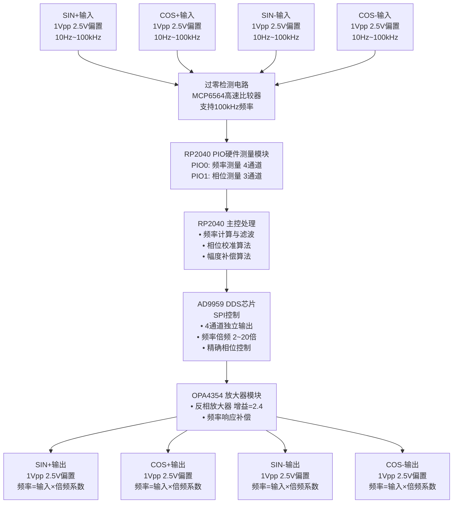


### 2.2 硬件选型


| 模块    | 芯片/器件   | 关键参数                 | 选型理由             |
| ----- | ------- | -------------------- | ---------------- |
| 主控MCU | RP2040  | 双核Cortex-M0+, 200MHz | 内置PIO硬件，支持高速信号处理 |
| DDS芯片 | AD9959  | 4通道，500MSPS          | 支持多通道同步输出，相位精度高  |
| 过零检测  | MCP6564 | 高速比较器                | 支持100kHz频率，响应速度快 |
| 放大器   | OPA4354 | 4通道运放                | 多通道集成，带宽足够       |
| 偏置电压  | 恒压源芯片   | 2.5V稳定输出             | 保证直流偏置稳定         |


### 2.3 关键电路参数

#### 输入电路参数

```
输入电容: Cin = 22μF
输入电阻: Rin = 1kΩ
```

**最小频率计算：**
根据RC高通滤波器特性：

```
f_min = 1 / (2π × R × C) = 1 / (2π × 1000 × 22×10⁻⁶) ≈ 7.2Hz
```

实际输入频率范围10Hz~100kHz远大于此值，确保信号能正常通过。

#### 放大器参数

```
反馈电阻: Rf = 2.4kΩ
输入电阻: Ri = 1.0kΩ
放大器增益: G = Rf / Ri = 2.4
```

---

## 3. 硬件设计详解

### 3.1 信号路径设计

#### 3.1.1 输入信号路径

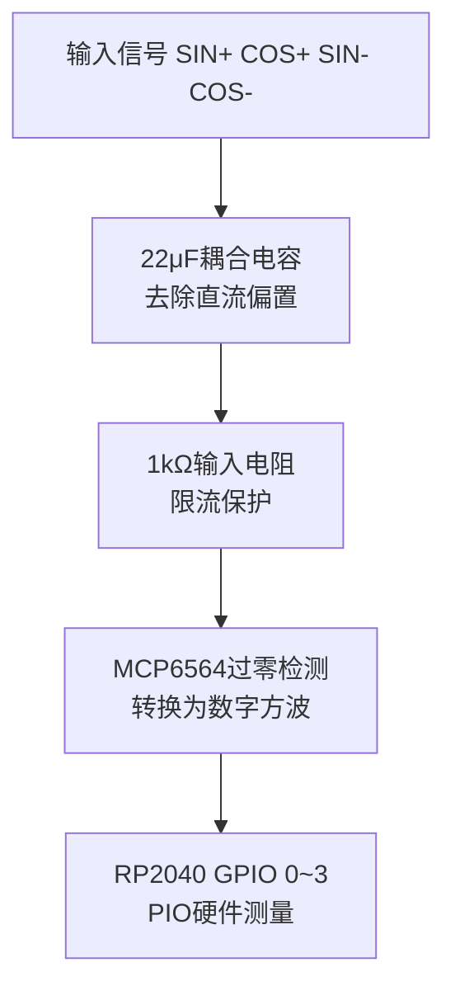


#### 3.1.2 输出信号路径

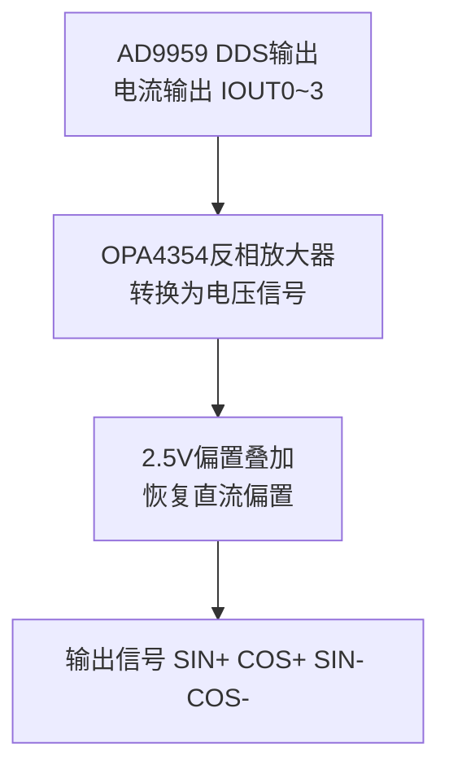


### 3.2 引脚分配


| 功能     | RP2040引脚            | 说明                      |
| ------ | ------------------- | ----------------------- |
| 频率测量输入 | GPIO 0~3            | 4路过零检测信号输入              |
| SPI通信  | GPIO 16, 18, 19, 20 | SPI总线 (RX, SCK, TX, CS) |
| DDS控制  | GPIO 17, 21         | RESET, UPDATE           |
| 串口调试   | UART0               | 115200波特率               |


### 3.3 AD9959通道映射


| GPIO通道 | 信号名称      | AD9959通道 | DDS输出 |
| ------ | --------- | -------- | ----- |
| GPIO 0 | COS-      | IOUT3    | OUT3  |
| GPIO 1 | SIN+ (参考) | IOUT0    | OUT0  |
| GPIO 2 | COS+      | IOUT1    | OUT1  |
| GPIO 3 | SIN-      | IOUT2    | OUT2  |


---

## 4. 软件设计详解

### 4.1 系统架构

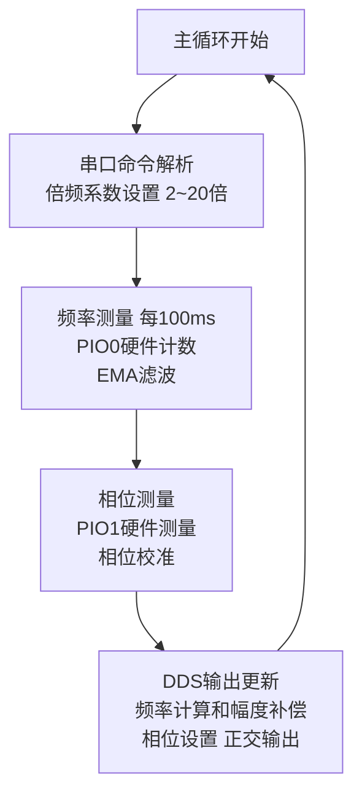


### 4.2 核心算法

#### 4.2.1 频率测量算法

**硬件测量（PIO）：**

- 使用PIO0的4个状态机（SM0~SM3）分别测量4路信号
- 每个SM持续计数上升沿，CPU定期读取计数值
- 测量方法：门控计数法（Gate Method）

**频率计算公式：**

```cpp
freq = (delta_edges × 1,000,000) / delta_us
```

**软件滤波：**

- 双样本确认：新频率必须在pending_freq的98%~102%范围内才接受
- EMA滤波：α = 0.2，快速响应
- 自适应重置：频率变化>1%时立即重置EMA，保证快速跟踪

#### 4.2.2 相位测量算法

**硬件测量（PIO）：**

- 使用PIO1的3个状态机测量相位差
- 参考信号：SIN+ (GPIO1)
- 测量目标：COS- (GPIO0), COS+ (GPIO2), SIN- (GPIO3)

**相位计算公式：**

```cpp
period_counts = F_CPU / ref_freq / 2.0  // PIO循环周期数
phase_deg = (delta_counts / period_counts) × 360.0
```

**相位校准：**

- 测量输入信号的相位偏差
- 输出时补偿偏差，确保输出信号精确正交

#### 4.2.3 幅度补偿算法（ACR智能调节）

**问题：** 放大器在不同频率下增益不同，需要补偿以保持1Vpp输出。

**解决方案：** 双点校准 + 线性插值

**校准参数：**

```cpp
CAL_FREQ_LOW  = 1kHz      // 低频校准点
CAL_VPP_LOW   = 1216mV    // 1kHz时ACR=1023的输出VPP
CAL_FREQ_HIGH = 2MHz      // 高频校准点
CAL_VPP_HIGH  = 1149mV    // 2MHz时ACR=1023的输出VPP
TARGET_VPP    = 1000mV    // 目标输出VPP
```

**ACR计算公式：**

```cpp
// 1. 计算校准点ACR值
CAL_ACR_LOW  = 1023 × (TARGET_VPP / CAL_VPP_LOW)
CAL_ACR_HIGH = 1023 × (TARGET_VPP / CAL_VPP_HIGH)

// 2. 线性插值
if (freq <= CAL_FREQ_LOW):
    ACR = CAL_ACR_LOW
else if (freq >= CAL_FREQ_HIGH):
    ACR = CAL_ACR_HIGH
else:
    slope = (CAL_ACR_HIGH - CAL_ACR_LOW) / (CAL_FREQ_HIGH - CAL_FREQ_LOW)
    ACR = CAL_ACR_LOW + (freq - CAL_FREQ_LOW) × slope
```

#### 4.2.4 DDS频率设置算法

**频率调谐字（FTW）计算：**

```cpp
FTW = (freq_hz × 2³²) / current_sys_clk
```

**系统时钟：**

- 基准时钟：25MHz
- PLL倍频：4倍（默认）
- 系统时钟：100MHz

**输出频率限制：**

```cpp
max_output_freq = current_sys_clk / 2  // 奈奎斯特定理
```

---

## 5. 时序分析

### 5.1 信号处理时序链

时间轴分析（以100kHz输入信号为例）：

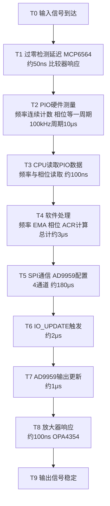


### 5.2 总延迟计算

**单次更新延迟：**

```
总延迟 = T1 + T2 + T3 + T4 + T5 + T6 + T7 + T8
       = 0.05μs + 10μs + 0.1μs + 3μs + 180μs + 2μs + 1μs + 0.1μs
       ≈ 196.25μs
```

**系统更新周期：**

- 更新间隔：100ms（UPDATE_INTERVAL_MS）
- 对于100kHz信号：100ms内包含10,000个周期
- 延迟占比：196.25μs / 100ms = 0.196%

**结论：** 系统延迟远小于更新周期，能够实时跟踪频率变化。

### 5.3 频率跟踪性能


| 输入频率变化   | 跟踪时间   | 说明             |
| -------- | ------ | -------------- |
| 1kHz步进   | <100ms | EMA重置阈值1%，快速响应 |
| 10kHz步进  | <100ms | 立即响应，EMA重置     |
| 100kHz步进 | <100ms | 立即响应，EMA重置     |


---

## 6. 代码设计流程

### 6.1 系统初始化流程

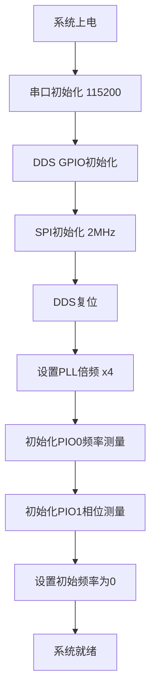


### 6.2 主循环流程

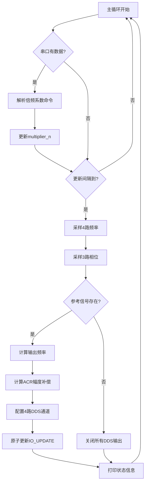


### 6.3 频率测量流程

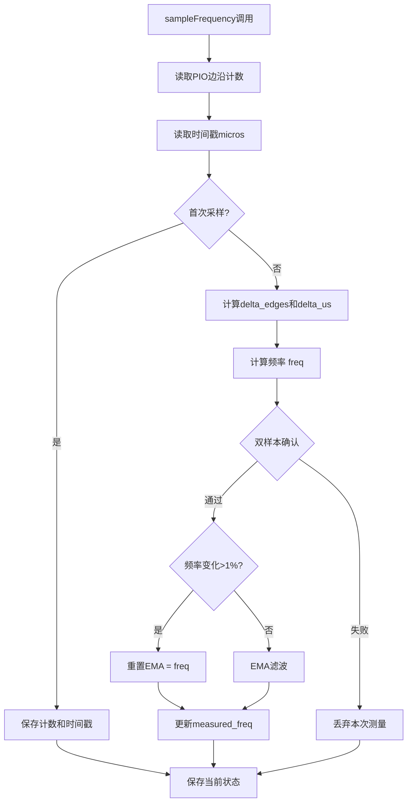


### 6.4 DDS输出更新流程

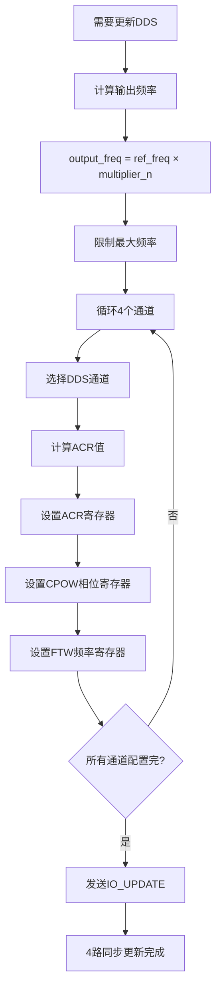


---

## 7. 关键代码模块说明

### 7.1 频率测量模块

**文件：** `measure.pio.h`

**功能：**

- PIO硬件实现边沿计数
- 无CPU开销，连续计数
- 支持32位计数，无溢出问题

**关键函数：**

```cpp
frequency_counter_program_init()  // 初始化PIO状态机
frequency_counter_read_count()    // 读取边沿计数
```

### 7.2 相位测量模块

**文件：** `phase_measure.pio.h`

**功能：**

- PIO硬件测量两信号间的相位差
- 分辨率：5ns @ 200MHz
- 测量参考边沿到目标边沿的时间

**关键函数：**

```cpp
phase_measure_program_init()  // 初始化相位测量
phase_measure_read()          // 读取相位差
```

### 7.3 幅度补偿模块

**函数：** `calculateSmartACR()`

**算法：**

1. 判断频率范围
2. 低频/高频使用固定ACR值
3. 中间频率线性插值

**优势：**

- 补偿频率响应
- 保证输出幅度稳定
- 双点校准，精度高

### 7.4 DDS控制模块

**函数：** `setSmartFrequencyAndPhase()`

**步骤：**

1. 计算并设置ACR（幅度）
2. 计算并设置CPOW（相位）
3. 计算并设置FTW（频率）
4. 触发IO_UPDATE

**特点：**

- 支持延迟更新（defer_update）
- 4通道原子更新
- 精确相位控制

---

## 8. 关键参数配置表

### 8.1 系统参数


| 参数      | 值     | 说明              |
| ------- | ----- | --------------- |
| 更新间隔    | 100ms | 频率/相位采样和DDS更新周期 |
| EMA滤波系数 | 0.2   | 频率平滑系数          |
| EMA重置阈值 | 1%    | 频率变化超过此值立即重置    |
| 双样本确认范围 | ±2%   | 频率测量确认范围        |


### 8.2 校准参数


| 参数      | 值      | 说明               |
| ------- | ------ | ---------------- |
| 低频校准点   | 1kHz   | 低频校准频率           |
| 高频校准点   | 2MHz   | 高频校准频率           |
| 目标VPP   | 1000mV | 输出目标峰峰值          |
| 低频校准VPP | 1216mV | 1kHz时ACR=1023的输出 |
| 高频校准VPP | 1149mV | 2MHz时ACR=1023的输出 |


### 8.3 DDS参数


| 参数     | 值      | 说明         |
| ------ | ------ | ---------- |
| 基准时钟   | 25MHz  | AD9959外部时钟 |
| PLL倍频  | 4倍     | 系统时钟倍频系数   |
| 系统时钟   | 100MHz | PLL输出时钟    |
| SPI速率  | 2MHz   | SPI通信速率    |
| 最大输出频率 | 50MHz  | 奈奎斯特频率     |


### 8.4 放大器参数


| 参数    | 值     | 说明    |
| ----- | ----- | ----- |
| 反馈电阻  | 2.4kΩ | Rf    |
| 输入电阻  | 1.0kΩ | Ri    |
| 放大器增益 | 2.4   | Rf/Ri |


---

## 9. 相位校准机制

### 9.1 输入相位测量

系统实时测量输入信号的相位关系：

- SIN+ (GPIO1) 作为参考（0°）
- 测量其他3路相对于SIN+的相位差

### 9.2 输出相位校准

即使输入信号不完全正交，输出信号也能保证精确正交：


| 输出通道        | 理想相位 | 说明     |
| ----------- | ---- | ------ |
| SIN+ (OUT0) | 0°   | 参考相位   |
| COS+ (OUT1) | 90°  | 超前90°  |
| SIN- (OUT2) | 180° | 超前180° |
| COS- (OUT3) | 270° | 超前270° |


**校准原理：**

- DDS硬件保证相位精度
- 输出时强制设置为理想相位值
- 不依赖输入信号的相位精度

---

## 10. 性能指标

### 10.1 频率测量性能


| 指标   | 数值            | 说明        |
| ---- | ------------- | --------- |
| 测量范围 | 10Hz ~ 100kHz | 输入频率范围    |
| 测量精度 | ±0.1%         | 基于PIO硬件测量 |
| 响应时间 | <100ms        | 频率变化跟踪时间  |
| 分辨率  | 1Hz           | 整数Hz分辨率   |


### 10.2 相位测量性能


| 指标   | 数值              | 说明         |
| ---- | --------------- | ---------- |
| 测量精度 | ±0.18° @ 100kHz | 基于PIO硬件测量  |
| 分辨率  | 5ns             | PIO时钟周期分辨率 |
| 测量范围 | 0° ~ 360°       | 全相位范围      |


### 10.3 输出性能


| 指标    | 数值           | 说明       |
| ----- | ------------ | -------- |
| 频率范围  | 20kHz ~ 2MHz | 输入×倍频系数  |
| 倍频范围  | 2 ~ 20倍      | 可调倍频系数   |
| 相位精度  | ±0.01°       | DDS硬件保证  |
| 幅度精度  | ±2%          | 经过ACR补偿后 |
| 幅度稳定性 | ±1%          | 频率响应补偿后  |


---

## 11. 使用说明

### 11.1 系统启动

1. 上电后系统自动初始化
2. 串口输出系统信息（115200波特率）
3. 等待输入信号

### 11.2 倍频系数设置

通过串口发送命令设置倍频系数：

```
格式：n=<2~20>
示例：n=5      // 设置5倍频
      10      // 也可以直接输入数字
```

### 11.3 状态监控

系统每100ms输出一次状态信息：

```
[n=5 f=50000Hz] SIN+(G1->I0): m=0.0° o=0°  COS+(G2->I1): m=90.2° o=90°  SIN-(G3->I2): m=180.1° o=180°  COS-(G0->I3): m=270.3° o=270°
```

**说明：**

- `n=5`: 当前倍频系数
- `f=50000Hz`: 输入参考频率
- `m=90.2°`: 测量相位
- `o=90°`: 输出设定相位

---

## 12. 测试验证

### 12.1 功能测试


| 测试项  | 测试方法            | 预期结果           |
| ---- | --------------- | -------------- |
| 频率测量 | 输入10Hz~100kHz信号 | 测量值与实际值误差<0.1% |
| 相位测量 | 输入正交信号          | 相位差90°±0.5°    |
| 倍频输出 | 设置不同倍频系数        | 输出频率=输入×倍频系数   |
| 幅度输出 | 测量输出VPP         | 1V±2%          |
| 相位输出 | 测量输出相位差         | 90°±0.1°       |
| 偏置电压 | 测量输出DC偏置        | 2.5V±0.05V     |


### 12.2 性能测试


| 测试项    | 测试条件          | 性能指标         |
| ------ | ------------- | ------------ |
| 频率跟踪速度 | 1kHz步进变化      | 跟踪时间<100ms   |
| 频率跟踪速度 | 10kHz步进变化     | 跟踪时间<100ms   |
| 频率稳定性  | 固定输入频率        | 输出频率抖动<0.01% |
| 幅度稳定性  | 10Hz~100kHz扫频 | 输出VPP变化<2%   |


---

## 13. 故障排查

### 13.1 常见问题


| 问题     | 可能原因       | 解决方法      |
| ------ | ---------- | --------- |
| 无输出信号  | 输入信号未连接    | 检查输入连接    |
| 输出频率错误 | 倍频系数设置错误   | 检查串口命令    |
| 输出幅度偏小 | ACR校准参数需调整 | 重新校准ACR值  |
| 相位不准确  | DDS配置错误    | 检查相位寄存器设置 |
| 系统无响应  | 程序死锁       | 重启系统      |


### 13.2 调试方法

1. **串口监控：** 查看系统状态输出
2. **示波器测量：** 验证输出信号参数
3. **频率计测量：** 验证输出频率精度
4. **相位计测量：** 验证相位关系

---

## 14. 维护说明

### 14.1 校准维护

**ACR校准：**

1. 在1kHz和2MHz两个频率点测量输出VPP
2. 更新代码中的`CAL_VPP_LOW_MV`和`CAL_VPP_HIGH_MV`
3. 重新编译烧录

**相位校准：**

- 系统自动测量输入相位
- 输出相位由DDS硬件保证，无需校准

### 14.2 软件更新

1. 使用Arduino IDE或PlatformIO编译
2. 通过USB连接RP2040
3. 上传新固件

---

## 15. 技术优势

### 15.1 硬件优势

1. **PIO硬件测量：** CPU零开销，实时测量
2. **AD9959 DDS：** 高精度频率和相位控制
3. **高速比较器：** 支持100kHz频率检测

### 15.2 软件优势

1. **智能滤波：** EMA滤波 + 自适应重置
2. **幅度补偿：** 双点校准，保证输出稳定
3. **相位校准：** 输出精确正交，不依赖输入

### 15.3 系统优势

1. **实时响应：** 100ms更新周期，快速跟踪
2. **高精度：** 频率精度0.1%，相位精度0.1°
3. **稳定性好：** 硬件测量，软件滤波，双重保障

---

## 16. 交付清单

### 16.1 硬件交付

- 集成化 PCBA（已烧录固件），集成 RP2040、AD9959、OPA4354、MCP6564 过零检测、2.5V 偏置电压源及全部相关电路
- 连接线缆（如适用）

以下为各核心模块原理图，供参考与维护。

**1. AD9959 DDS 模块原理图**

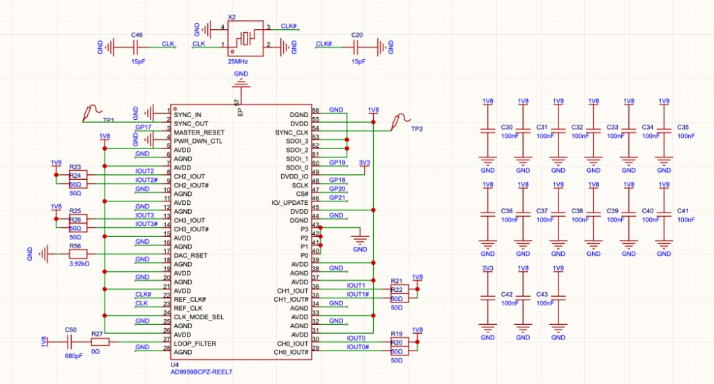

**2. RP2040 主控原理图**

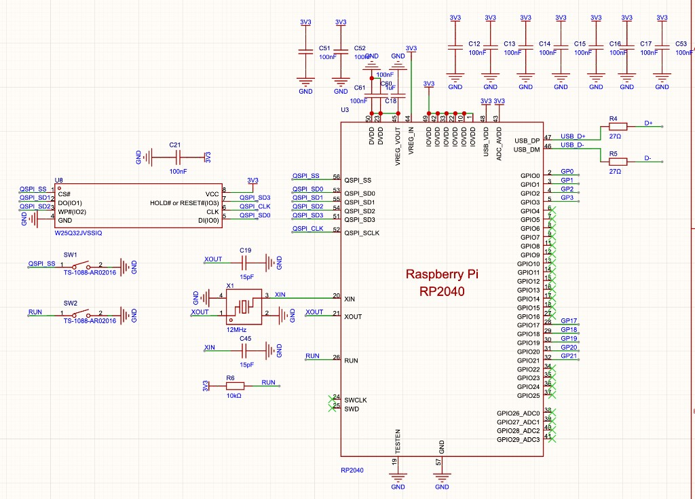

**3. 过零检测电路原理图（MCP6564）**

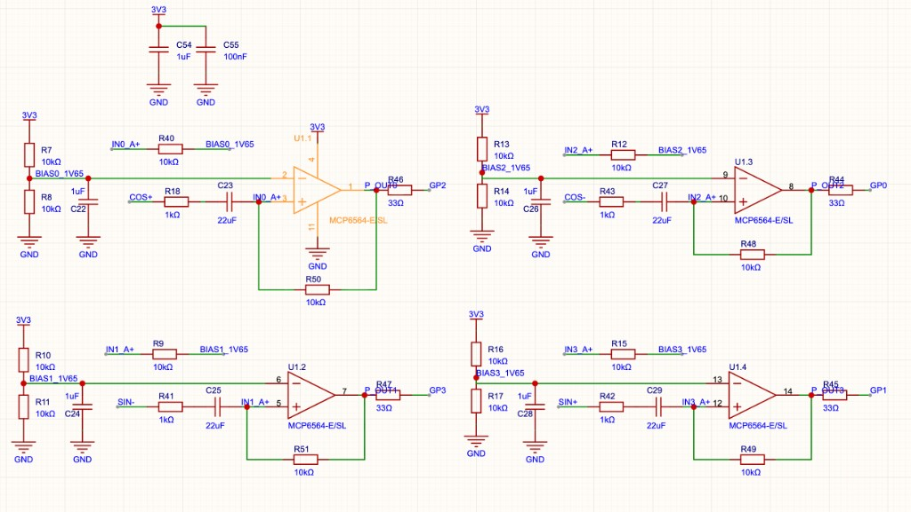

**4. 放大器原理图（OPA4354）**

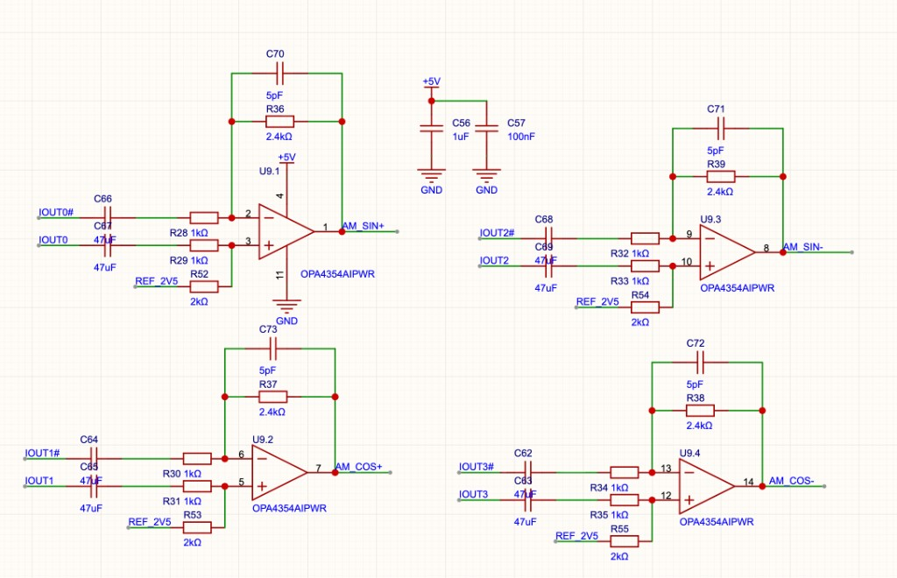

### 16.2 软件交付

- 源代码（main.ino）
- PIO程序（measure.pio.h, phase_measure.pio.h）
- 编译好的固件（.uf2文件）
- 交付文档（本文档）

---

## 附录A：代码关键函数索引


| 函数名                              | 功能        | 位置                      |
| -------------------------------- | --------- | ----------------------- |
| `sampleFrequency()`              | 频率采样和计算   | main.ino:237            |
| `samplePhase()`                  | 相位采样和计算   | main.ino:289            |
| `calculateSmartACR()`            | ACR幅度补偿计算 | main.ino:167            |
| `setSmartFrequencyAndPhase()`    | DDS频率相位设置 | main.ino:189            |
| `frequency_counter_read_count()` | PIO频率计数读取 | measure.pio.h:86        |
| `phase_measure_read()`           | PIO相位测量读取 | phase_measure.pio.h:123 |


## 附录B：寄存器映射

### AD9959关键寄存器


| 寄存器   | 地址   | 功能            |
| ----- | ---- | ------------- |
| CSR   | 0x00 | 通道选择寄存器       |
| FR1   | 0x01 | 功能寄存器1（PLL配置） |
| CFTW0 | 0x04 | 通道0频率调谐字      |
| CPOW0 | 0x05 | 通道0相位偏移字      |
| ACR   | 0x06 | 幅度控制寄存器       |
| CW1   | 0x0A | 通道1频率调谐字      |


---

**文档结束**