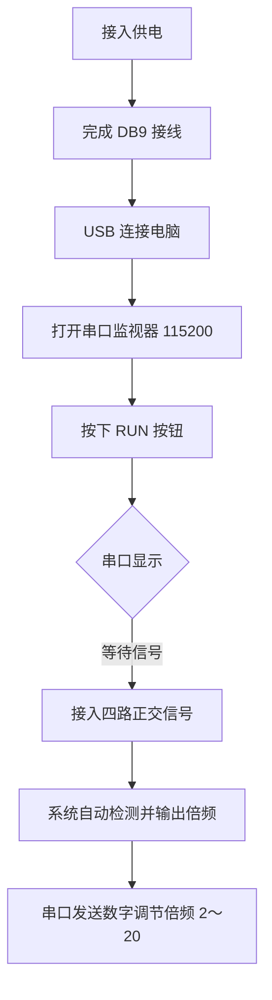

# 四路正交信号频率倍频系统 - 使用文档

---

## 1. 正常使用流程



*文字流程*：供电 → 接线 → USB 连电脑 → 串口 115200 → 按 RUN → 见「等待信号」后接入四路正交信号 → 系统输出倍频 → 串口发数字调节倍频。

---

## 2. 供电与连线

### 2.1 供电

| 项目 | 说明 |
|------|------|
| 供电方式 | **DB9 供电**（引脚 7=5V，引脚 2=GND）/ **USB 供电**，二者均可 |
| 供电要求 | 外部 5V 时至少 **5V 1A**，电源稳定 |

### 2.2 DB9 接口

| 引脚 | 信号/功能 | 线色 |
|------|-----------|------|
| 1 | Z- | 黑 |
| 2 | 0V (GND) | 棕 |
| 3 | COS- | 红 |
| 4 | NC（空） | 橙 |
| 5 | SIN+ | 黄 |
| 6 | Z+ | 绿 |
| 7 | 5V (VDD) | 蓝 |
| 8 | COS+ | 灰 |
| 9 | SIN- | 白 |

| 引脚 | 信号 | GPIO |
|------|------|------|
| 5, 8, 9, 3 | SIN+, COS+, SIN-, COS- | 1, 2, 3, 0 |
| 7, 2 | 5V, GND | — |

---

## 3. 串口监视

| 操作 | 说明 |
|------|------|
| 串口工具 | Arduino IDE 串口监视器或 PuTTY、串口助手等 |
| 波特率 | **115200** |
| 触发输出 | 按下 **RUN** 按钮，等待串口打印 |

---

## 4. 串口命令与数据

### 4.1 倍频调节

| 项目 | 说明 |
|------|------|
| 设置方式 | 串口直接发送数字，如 `4` 表示 4 倍频 |
| 有效范围 | **2～20** |
| 确认 | 串口回复 "Multiplier set to: X" |

### 4.2 数据格式

**示例**：
```
[n=1 f=30000Hz] SIN+(G1->I0): m=0.0° o=0°  COS+(G2->I1): m=90.1° o=90°  SIN-(G3->I2): m=180.2° o=180°  COS-(G0->I3): m=270.0° o=270°
```

| 字段 | 含义 |
|------|------|
| n | 倍频系数 |
| f | 输入频率（Hz） |
| m | 测量相位（度） |
| o | 理想相位（度） |
| OFF | 该通道无有效输入 |

---

## 5. 故障排查

| 现象 | 处理 |
|------|------|
| **放大器无输出**（输入端有 1Vpp、2.5V 偏置正弦信号） | `main.ino` 约第 433 行将 `setPLL(6)` 改为 `setPLL(8)`，重新编译烧录。会提升功耗与驱动能力，波形更完整 |
| **系统无反应** | 按下 **RUN** 约 1 秒，系统复位重启。观察串口输出的倍频、相位、频率信息 |

---

## 6. 注意事项

- 上电后等待数秒再接入信号
- 无串口输出时检查 USB、串口选择、**波特率 115200**
